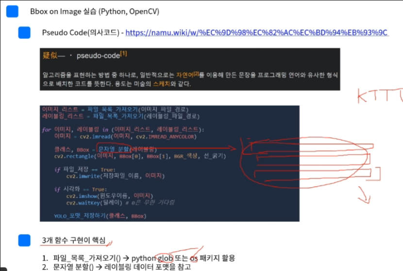

# Open Datasets

0. 기본 개요
* EDA(데이터 탐색) -> 데이터 가공 및 전처리 -> 데이터 검증 -> 데이터 split -> 학습 방법 결정

1. KITTI
* 2012년 데이터
* 2D Object Detection
  * Left, Right 이미지
  * LiDAR 데이터
  * Calibration 정보
  * 레이블링 데이터
  * [cx,cy,width,height]의 정규화된 형식
  * 
* 3D Object Detection(라이다 데이터 활용)
* Bird eyes view
  

1. BDD100K
* 2017년 데이터
* 자율주행을 위한 딥러닝 어플리케이션 데이터 셋
* 다양한 도시, 다양한 환경에 대한 데이터로써 현실적인 상황 반영
* 100K Images, Detection 2020 Labels
* Labeling Format : JSON(JavaScript Object Notation)

3. Cityscape
* Semantic Segmentation을 위한 데이터 셋

4. scale
* 자율주행과 관련된 다양한 데이터를 전체적으로 확인할 수 있는 사이트

5. Papers With Code
* 다양한 딥러닝 모델을 찾아볼 수 있는 사이트