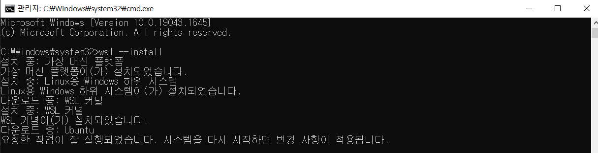

# Data Labeling

1. 개요
* Raw Data를 유의미한 작업에 사용하도록 데이터를 만드는 작업
* Labeling = Annotation = Tagging
* 작업에 대한 결과를 미리 입력하는 작업
* 이 데이터는 모델이 만들어낼 수 있는 최대 검출(또는 분류) 성능이 된다(지도학습)
* 또 다른 데이터를 만들어내는 재료가 되기도 한다(GAN)

2. Labeling tools
* CVAT
  * segmentation, bbox 모두 labeling 가능
    > CVAT 설치 방법
    > >1. cmd창을 Ctrl+Shift+Enter로 관리자 권한으로 실행
    > >2. WSL2 설치
    > >
    > >3. Docker Desktop 설치
    > >4. Docker Desktop 환경에서 CVAT 설치
    > >
    > > ``` bash
    > > git clone https://github.com/opencv/cvat
    > > cd cvat
    > > docker-compose up -d
    > > ```
    > > 5. http://localhost:8080/auth/login 에서 회원가입 및 로그인

* Labelme
* labelmg
