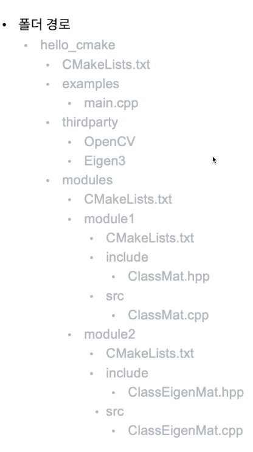

# Week 15 Day 2, CMake

1. CMake 
* 시스템이 다르면 소프트웨어도 이어지지 않음
* 동일한 소스코드를 다른 플랫폼에서 재 컴파일 후 빌드를 하기 위한 파일
* 어떤 플랫폼에서도 사용할 수 있는 범용적인 소프트웨어
* 빌드, 테스팅, 패키징 등을 모두 소화할 수 있는 소프트웨어
* 컴파일러와는 독립적인 작동 방식을 가지고 있음
* 직접 빌드를 해주는 것은 아니고 빌드 커맨드를 생성해주는 소프트웨어

> 학습 목표
> 
> 3rdParty library build
> 
> Make a C++ project

2. 실습
* github에 CMakeList.txt 파일이 있다면, CMake로 빌드를 지원하겠다. 라는 의미
* 3rdParty build tutorial
```bash
sudo apt-get install -y cmake
git clone https://github.com/opencv/opencv.git
cd opencv/
mkdir build
mkdir install
cd build
#cmake ../opencv/
#cmake -DCMAKE_BUILD_TYPE=Debug ../opencv/ 
#cmake -DCMAKE_BUILD_TYPE=Release ../opencv/
# debug 모드로 실행, -D는 파라미터를 뜻함
#cmake -DCMAKE_BUILD_TYPE=Release -GNinja -DCMAKE_INSTALL_PREFIX=../install ../opencv/
cmake -DCMAKE_BUILD_TYPE=Release -DCMAKE_INSTALL_PREFIX=../install ../opencv/
# -G는 Generator를 뜻함
# CMAKE_INSTALL_PREFIX -> 설치 위치
# CMAKE_BUILD_TYPE ->디버그, 릴리즈 모드 선택

make -j4
# -j : CPU 코어 할당 관련
cd lib
cd ..
sudo make install
```
* Make a C++ project tutorial
  * 사용 IDE : CLion
    * terminal
    ```bash
    cd thirdparty/
    mkdir OpenCV
    cd OpenCV
    git clone https://github.com/opencv/opencv.git
    mkdir build
    mkdir install
    cd build
    cmake -DCMAKE_BUILD_TYPE=Debug -DCMAKE_INSTALL_PREFIX=../install ../opencv
    make
    sudo make install
    # thirdparty 경로로 이동
    mkdir Eigen3
    mkdir build
    mkdir install
    cd build
    cmake -DCMAKE_BUILD_TYPE=Debug -DCMAKE_INSTALL_PREFIX=../install ../eigen
    sudo make install
    ```
    * CMakeLists.txt
    ```bash
    cmake_minimum_required(VERSION 3.22)
    project(hello_cmake LANGUAGES CXX)

    set(CMAKE_CXX_STANDARD 14)
    set(CMAKE_CXX_STANDARD_REQUIRED ON)  # limited standard 14

    add_subdirectory(modules)

    add_executable(hello_cmake main.cpp)

    add_executable(exec_module1 examples/exec_module1.cpp)
    target_link_libraries(exec_module1 PRIVATE
            module1
            )

    add_executable(exec_module1_module2 examples/exec_module1_module2.cpp)
    target_link_libraries(exec_module1_module2 PRIVATE
            module1
            module2
            )
    ```

    