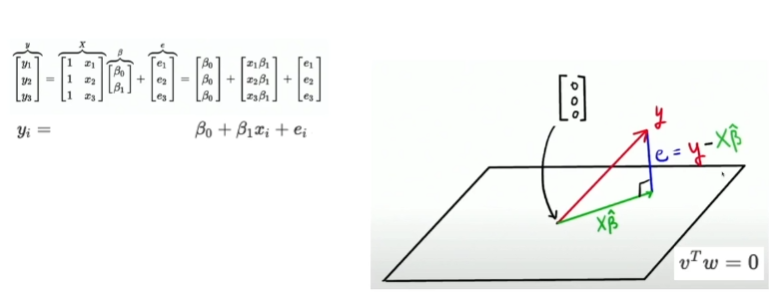
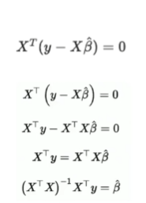

# Week15 Day2, 선형대수

1. Vector and matrices
* Vector
  * CS에서의 벡터 : List
  * 물리학에서의 벡터 : 힘의 크기와 방향
  * 수학에서의 벡터 : 공간 속 좌표

* Matrix
  * Vector의 집합
  * 하나의 벡터를 다른 벡터로 매핑(회전, 크기 변환 등)

2. The Geometry of Least Squares
* Linear regression
    
    * orthogonal(직교) 상태를 곱하면 0이 된다는 점을 이용
    

3. SVD(Singular Value Decomposition)
* Schur, LU, QR, Cholesky
* 매트릭스를 분해하여 각각의 목적을 파악 가능
* SVD
  * 하나의 매트릭스를 U,S,V^T로 분해하는 기법
  * U, V^T : 특징 / S : 가중치