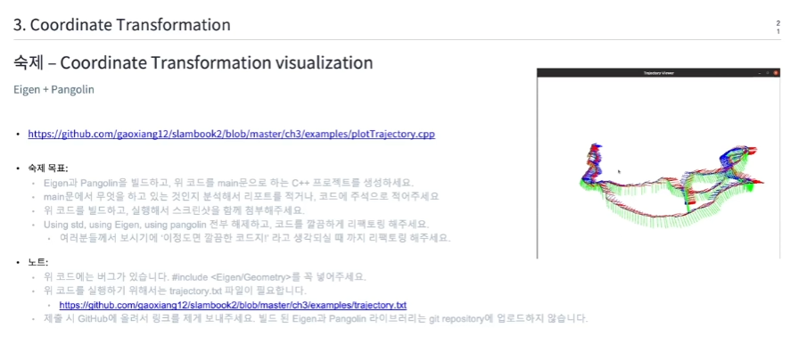

# Week 15 Day3, 3D 회전과 이동

1. 3D Rigid Body Motion
   * 물체의 위치와 방향성을 가지는 강체(Position+orientation = pose)
   * Euclidean world에서 사용되는 Cartesian coordinate
2. 회전 표현법
* Rotation
   * Euler Angle
     * Roll / Pitch / Yaw
     * 장점 : 이해하기 쉬움
     * 단점
       * 최적화에 어려움이 있음
       * Gimbal lock : Degree of Freedom이 사라지는 문제(Singularity problem), ,이 문제로 인해 SLAM에서 사용하지 않음
   * Axis-angle
     * 물리학에서 벡터를 바라보는 방식
     * 유닛 벡터 e, 회전 $ϴ$
     * 메모리의 효율성이 좋음(4개의 파라미터, 혹은 3개의 파라미터를 사용)
   * Quaternion
     * Singularity가 나타나지 않는 최소한의 파라미터 개수는 4개
     * 4차원에서 복소수를 사용함
     * 미분이 가능함
   * SO(3) Rotation matrix
     * 회전만 가능한 matrix
     * x,y,z 축이 회전 후에도 orthgonal(직교성)을 유지해야함
     * 각 축의 유닛 벡터가 바뀌면 안됨(determinant = 1)
     * 역함수가 존재해야 하며 그 역함수는 Transpose matrix이다
     * 3축을 회전하기 위해 9개의 파라미터가 필요해야 함
     * Singularity 문제 X
     * 조건이 많기 때문에 최적화를 위해 바로 사용하기 어려움
* Transformation
  * 벡터로 표현하면 됨(단, 단위는 통일해야 함)
  * SE(3) Transformation matrix
    * Special Euclidean Group
      * $\begin{bmatrix}R&t\\0^T&1\\ \end{bmatrix}$
      * 1 -> uclidean world의 스케일, 대부분 1값
* 실습
  * Code
    ``` cpp
    #include <Eigen/Dense>
    #include <iostream>
    #include <cmath>
    #include <Eigen/Geometry>
    using namespace Eigen;
    using namespace std;

    int main(){
        //Matrix initialization method 1
        Matrix<double, 2, 3> matrix23_double;
        matrix23_double << 1.8, 2.0, 3.0, 4.0, 5.0, 6.0;

        //Matrix initialization method 2
        Matrix3d matrix33_double = Matrix3d::Zero();

        //Matrix initialization method 3
        Matrix<double, Dynamic, Dynamic> matrix_dynamic;

        //Vector initialization method 1
        Vector3d vec = {1.0, 2.0, 3.0};

        //Vector initialization method 2
        Vector3d vec_zeros = Vector3d::Zero();

        //Rotate 45 degrees along z axis
        AngleAxisd rotation_vector(M_PI / 4.0, Vector3d{0.0, 0.0,1.0});

        Vector3d vector{1.0, 0.0, 0.0};

        Vector3d rotated_vector = rotation_vector * vector;

        //Rotate 45 degrees along z-axis
        Quaterniond quat = Quaterniond(rotation_vector);
        
        cout <<"matrix23_double"<<endl<< matrix23_double << endl;
        cout <<"matrix33_double"<<endl<< matrix33_double << endl;
        cout <<"matrix_dynamic"<<endl<< matrix_dynamic << endl;
        cout <<"vec"<<endl<< vec << endl;
        cout <<"vec_zeros"<<endl<< vec_zeros << endl;
        cout <<"matrix23_double for each"<<endl<< vec_zeros << endl;
        for(int row=0; row<matrix23_double.rows();row++){
            for(int col = 0; col<matrix23_double.cols();col++){
                cout << matrix23_double(row,col)<<"\n";
            }
        }

        cout<<"rotation vector = " << endl;
        cout <<rotation_vector.matrix()<<endl;
        cout<<endl;

        cout << " rotated vector = " <<endl;
        cout << rotated_vector.transpose() << endl;

        cout << "quaternion = " << quat.coeffs().transpose() << endl;
        cout << endl;

        cout << "rotated vector = " <<(quat * vector).transpose() << endl;
        
        return 0;
    }
    ```

* https://github.com/gaoxiang12/slambook2/blob/master/ch3/examples/plotTrajectory.cpp
