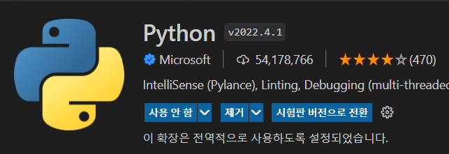

# Python 환경 VS CODE에서 구축하기

* VS CODE 에서 ipynb 환경 설정
데이터 분석, 머신러닝 환경에서는 블록 단위로 실행할 수 있는 Jupyter Note이 매우 강력한 IDE이다. 따라서 Jupyter notebook에서 사용하는 확장자인 ipynb를 사용한다. 
  - 사용 단점 : Jupyter Notebook은 블럭 단위 실행 때 실시간으로 상황을 볼 수 있으나 VS CODE에는 실행이 완전히 종료되어야만 결과를 볼 수 있음

> Extension 설치 순서
> 1. Python 익스텐션 설치

> 

> 2. 커맨드 팔레트(Ctrl + Shift + P) 켜기
> 3. 검색참에 create 입력
> 4. Jupyter:Create New Blank Notebook 선택

1. Numpy 개요
* 파이썬 내장 list는 연산속도가 매우 느림
* 계산 속도를 빠르게 해주는 numpy 모듈
* 관례적으로 alias를 활용하여 np로 작성 (import numpy as np)

2. Numpy 연산
* Vector와 Vector의 연산, Vector와 Scalar의 연산 모두 지원
* List와 유사하게 Indexing을 활용하여 특정 위치의 원소를 가져올 수 있음 / Slicing도 동일하게
    - 2차원일 때 [2][3]이 아닌 [2,3] 처럼 작성하여 참조
    - -를 사용하면 뒤에서 부터 접근할 수 있다
* Array의 Broadcasting은 numpy가 연산을 진행하는 특수한 방법이다.
    1. M x N, M x 1
    2. M x N, 1 x N
    3. M x 1, 1 x N

3. Numpy와 선형대수
* np.zeros([3,3]) : 영벡터 생성
* np.ones([3,3]]) : 일벡터 생성
* np.diag((2,3)) : 대각행렬 생성
* np.eye(2, dtype=int) : 항등행렬 생성, 데이터 타입 지정 가능, default는 float64
* np.dot() or @ : 행렬 간의 곱 연산
* np.trace() : Main diagonal의 합
* np.linalg.det() : 행렬식(determinant) 계산
* np.linalg.inv() : 역행렬 계산
* np.linalg.eig() : eigenvalue와 eigenvector 계산, 정규화된 값 반환
  

> 새로 알게된 내용
> > % : notebook 환경의 특수한 매직 키워드
> > %timeit : 시간을 알려주는 명령어, 소요시간을 알고 싶은 line 앞에 작성
> > range(1000)와 np.arrange(1000)에서 arrange는 더욱 세밀하게 쪼개서 사용할 수 있다.

> 궁금한 내용
> > exercise 1 에서 직접 구현한 L2_norm과 numpy에서 제공하는 np.linalg.norm을 각각 사용해보았을 때 numpy가 더 느렸음. 이 차이가 왜 발생했을까?
